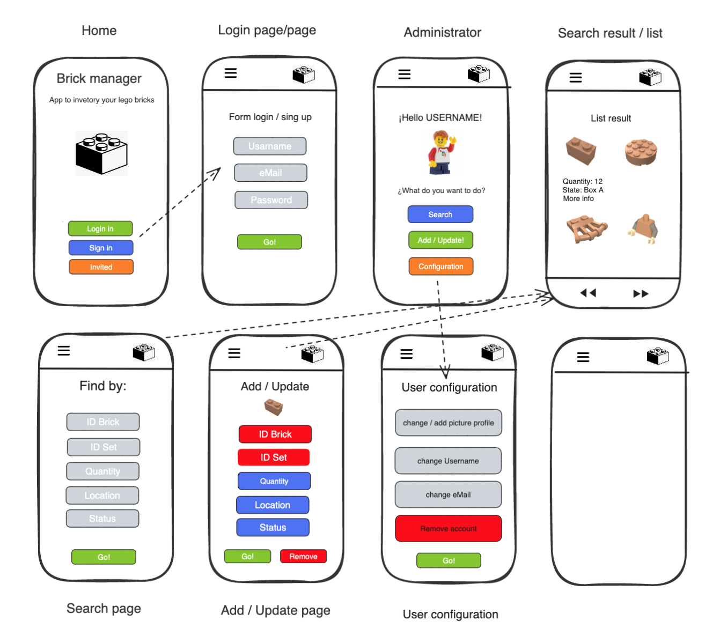

# App name

Easy Brick Manager

## Description

Easy Brick Manager is a responsive App to create, admin and delete inventories of Lego parts. Each user has to be registered on the App to have to access his own inventory. The user can create boxes and assign them to his Lego Parts.

---

## Wireframes


---

## Instructions

When cloning the project, change the <code>sample.env</code> for an <code>.env</code> with the values you consider:
```js
PORT=3000
MONGO_URL='mongodb://localhost/dbName'
SESSION_SECRET='SecretOfYourOwnChoosing'
NODE_ENV='development'
```
Then, run:
```bash
npm install
```
To start the project run:
```bash
npm run start
```

---

## User stories (MVP)

What can the user do with the app?
- User can sign up, create and delete an account
- User can login and log ouy
- User can create/admin/delete a box storage
- User can create/admin/delete a Lego Part and assign to a box storage.

## User stories (Backlog)

- User can upload a profile picture
- User can add a box picture with a url image.

---

## Models


User:

```js

const userSchema = new Schema(
  {
    username: {
      type: String,
      trim: true,
      required: [true, 'Username is required.'],  
      unique: true
    },
    email: {
      type: String,
      required: [true, 'Email is required.'],
      unique: true,
      lowercase: true,
      trim: true
    },
    userIsAdmin: {
      type: Boolean,
      default: false,
      required: [true, 'Is required.']
    },    
    usertype: {
        type: String,
        // requiered: true,
    },
    imageUrl: {
        type: String,
    },
    hashedPassword: {
      type: String,
      required: [true, 'Password is required.']
   }

  }

const brickSchema = new Schema(
{
    brickCategoryId: {
        type: Schema.Types.ObjectId,
        ref: "BrickCategory"
    },
      brickCategoryName: {
           type: Schema.Types.ObjectId,
        ref: "BrickCategory"
    },
    quantity: {
        type: Number,
        required: [true, 'Quantity stock is required.'],
    },
    userId: {
        type: Schema.Types.ObjectId,
        ref: "User"
    },
    status: {
        type: String,
        enum: ["Using", "Stored", "Lost"],
        required: [true, "Status is required"],
    },
    storageId: {
        type: Schema.Types.ObjectId,
        ref: "Storage"
    },
    storageName: {
        type: Schema.Types.ObjectId,
        ref: "Storage"
    },

});

const brickCategorySchema = new Schema(
    {
      brickCategoryName: {
        type: String,
        trim: true,
        required: [true, 'brick name is required.'],
        unique: true
      },
      brickCategoryLegoId: {
        type: String,
        unique: true
      },
      picture: {
        type: String,
        default: "/pictures/default-brick.png"
      },
      color: {
         type: String,
         required: [true, 'Color is required.'], 
      },
      setId: {
        type: [String]
      },
      userId: {
        type: [Schema.Types.ObjectId],
        ref: "User"
    },
  }
  );  

const storageSchema = new Schema( 
    {
      boxname: {
        type: String,
        trim: true,
      },
      picture: {
        type: String,
        default: "/pictures/default-storage.jpg"      
      },
      userId: {
        type: Schema.Types.ObjectId,
        ref: "User"
      }
    }
  );
```

---

## Routes


| Name  | Method | Endpoint    | Protected | Req.body            | Redirects |
|-------|--------|-------------|------|---------------------|-----------|
| Home  | GET   | /index           | No   |                     |           |
| Login | GET    | /auth/login | No |                      |           |
| Login | POST | /auth/login   | No | { email, password }  | /         |
| Signup | GET    | /auth/signup | No |                      |           |
| Signup | POST | /auth/signup   | No | { username, email, password }  | /auth/login  |
| New brick  | GET   | /create-brick | Yes |                      |bricks/create-brick
| New brick | POST | /create-brick  | Yes | { title, cast, genre }  | /brick/list   |
| New box  | GET    | /create | Yes |                      |        storage/new-storage   |
| New box | POST | /create  | Yes | { title, cast, genre }  | /storage/storage  |
​


## Useful links

- [Github Repo](https://github.com/GuiLLeMet85/module2-boilerplate)
- [Deployed version](https://brickmanager.herokuapp.com/)
- [Presentation slides](https://slides.com/guillemb/palette)


